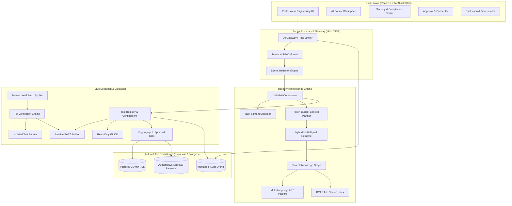

# HackSync — System Architecture

## 1. Architectural Philosophy

HackSync is designed around four foundational architectural principles:

1. **Deterministic Intelligence Over Unbounded Autonomy**: HackSync is NOT an autonomous agent that runs arbitrary commands or modifies code in the background. It is a deterministic engineering control plane.
2. **Strict Read-Only AI Boundary**: The AI Orchestrator and Tool Registry operate strictly in read-only mode. Mutating actions require structured human approval.
3. **Evidence-First Retrieval**: Every suggestion, security finding, and explanation must be backed by real line-level codebase evidence verified against the AST knowledge graph.
4. **Resilience and Graceful Degradation**: External AI providers are untrusted dependencies guarded by circuit breakers and multi-provider fallbacks. Core intelligence functions 100% offline.

---

## 2. Complete System Topology

---

## 3. Data Flow Across Phases

### Phase 1: Repository Indexing & Knowledge Graph
$$\text{Source Files} \longrightarrow \text{AST Parsers (Babel/Python/SQL)} \longrightarrow \text{Symbol Index + Dependency Graph + BM25 Index} \longrightarrow \text{ProjectKnowledgeGraph}$$
- Files are parsed incrementally into abstract syntax trees.
- Symbols (functions, classes, interfaces, types) are indexed with file, line range, and references.
- In-memory storage is strictly scoped per `projectId`.

### Phase 2: Hybrid Retrieval
$$\text{Developer Query} \longrightarrow \text{Symbol Matches (+40)} + \text{Path Matches (+25)} + \text{BM25 (+20)} + \text{Graph Distance (+15)} \longrightarrow \text{Top-K Ranked Code Snippets}$$
- Retrieves verified code evidence within a strict token budget.
- Cross-project file paths are rejected.

### Phase 3: Security & Git Safety
$$\text{Knowledge Graph} \longrightarrow \text{Passive SAST Rules + Secret Scanner + Dependency Manifests} \longrightarrow \text{SecurityReport with Evidence Lines}$$
- Read-only analysis with zero shell commands.
- Read-only Git commands (`status`, `diff`, `log`, `branch`) executed with strict argument allowlisting and `shell: false`.

### Phase 4: Human-in-the-Loop Fix-Test-Verify Loop
$$\text{Finding} \longrightarrow \text{Fix Proposal} \longrightarrow \text{SHA-256 Hashed Unified Diff} \longrightarrow \text{Human Approval Gate} \longrightarrow \text{Transactional Apply} \longrightarrow \text{Targeted Tests} \longrightarrow \text{Security Rescan} \longrightarrow \text{VERIFIED}$$
- Patches must be approved by project lead or owner.
- Max 3 fix attempts per lifecycle.
- Automatic atomic rollback if application fails midway.

### Phase 5 & 6: Evaluation & Observability
$$\text{Orchestrator Run} \longrightarrow \text{Output Validator (Citation Verification)} \longrightarrow \text{Audit Logger (Immutable Append-Only)} \longrightarrow \text{Observability Metrics (Tokens, Cost, Latency)}$$
- All citations validated against actual indexed project files.
- Correlation ID (`requestId`) propagated from client to database.

---

## 4. Security Boundaries

| Boundary | Mechanism | Failure Mode |
|---|---|---|
| **API Gateway** | Token bucket rate limiting + JWT verification | HTTP 429 / HTTP 401 |
| **Tenancy** | `TenantGuard.validateProjectAccess` + PostgreSQL RLS | HTTP 403 Forbidden |
| **Tool Execution** | Fixed allowlist + prohibited mutating commands check | `Unknown AI tool` error |
| **Diff Integrity** | SHA-256 diff hash + Base state hash check | `PATCH_BASE_STATE_MISMATCH` / Rollback |
| **Test Runner** | `execFile` with `shell: false` + stripped sensitive env vars | Non-zero exit code (contained) |
| **Git Safety** | Allowlisted read-only subcommands only | `AuthorizationError` before process spawn |
| **AI Providers** | Circuit breaker (CLOSED -> OPEN -> HALF_OPEN) | Fast-fail & fallback to deterministic engine |
