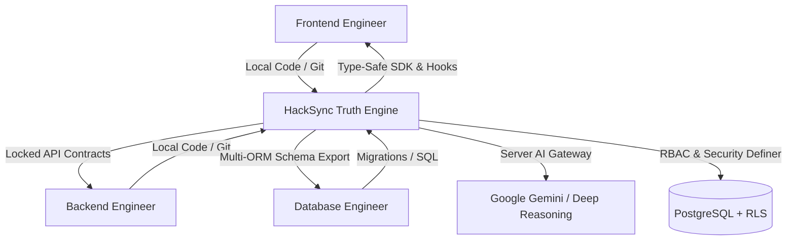

# HackSync — Enterprise Hackathon Integration & Truth Control Center

[](https://github.com/hacksync/hacksync)
[](#)
[](https://www.typescriptlang.org/)
[](https://supabase.com/)

> **Three laptops. One connected codebase.**
> HackSync is the single source of truth and real-time integration control center for distributed hackathon teams. Frontend, backend, and database engineers work independently in their local environments, while HackSync prevents drift, verifies API contracts, tracks PostgreSQL schemas, and audits cyber security vulnerabilities before the final demo.

---

## 🌟 Key Architecture & Capabilities



### 1. Granular RBAC & Role Capabilities
Strict Role-Based Access Control enforced at both UI and Supabase PostgreSQL RLS levels:
- **`owner`**: Full workspace control, project deletion, role assignment, contract locking, schema migrations.
- **`lead`**: Workspace administration, team member management, contract locks, schema migrations.
- **`backend`**: Manages API contracts, endpoint schemas, mock simulations, task updates.
- **`database`**: Manages database tables, column ordinality, foreign key indexes, and DDL migrations.
- **`frontend`**: Consumes type-safe SDKs, manages UI tasks and local vibe coding files.
- **`member`**: Read-only workspace inspection.

### 2. Real Production Supabase Authentication
- **Session Enforcement**: Verified JWT tokens, secure token refresh, and auth guards on all authenticated routes (`/_authenticated/*`).
- **Zero Mock Tokens**: Eliminated all fake guest logins and bypass keys.
- **Isolated Demo Sandbox**: Dedicated `/demo` route with in-memory simulation for evaluators that never touches or mutates database tables.

### 3. Server AI Security Gateway
- **Zero Key Leaks**: No API keys stored in client `localStorage`.
- **Token-Bucket Rate Limiting**: In-memory bucket enforcing 12 requests/minute per client.
- **Model Allowlisting**: Validates allowed models (`gemini-2.0-flash`, `gpt-4o-mini`, `builtin`).
- **Offline Fallback**: Integrated Deep Reasoning Engine capable of answering algorithmic and architectural questions 100% offline.

### 4. Vibe Coding Local File System Synchronization
- Utilizes the native W3C File System Access API (`showDirectoryPicker`) to link local repository folders.
- Bi-directional scanning, syntax highlighting, and live file editing with zero server latency.

---

## 🚀 Quick Start

### Prerequisites
- [Bun](https://bun.sh/) (v1.2+) or Node.js (v20+)

### Installation
```bash
# Clone the repository
git clone https://github.com/shreybhuva123-cyber/hacksync.git
cd hacksync

# Install dependencies
bun install

# Set up environment variables
cp .env.example .env

# Run local development server
bun dev
```

The application will start at `http://localhost:8080`.

---

## 🧪 Testing & Verification

HackSync maintains 100% unit test pass rates across domain services, Zod validation schemas, RBAC permissions, and cyber security audits:

```bash
# Run unit & integration tests
bun test

# Typecheck TypeScript codebase
bunx tsc --noEmit

# Run production build
bun run build

# Run Playwright E2E verification
python scratch/run_production_e2e.py
```

---

## 🛡️ Cyber Security Sentinel

Automated OWASP Top 10 scanner identifying:
1. **OWASP A01: Broken Object-Level Authorization (BOLA / IDOR)**
2. **OWASP A03: SQL Injection (SQLi)** in unparameterized query bindings
3. **OWASP A07: Identification and Authentication Failures** on unauthenticated mutation routes
4. **1-Click Auto-Patching**: Instant remediation blueprints applied directly to workspace state.

---

## 📄 License
MIT License. Built for hackathons, engineering competitions, and distributed development teams.
