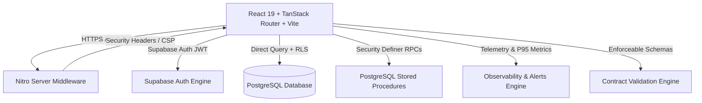

# HackSync — Enterprise Hackathon Integration & Truth Control Center

[](https://github.com/hacksync/hacksync)
[](#)
[](https://www.typescriptlang.org/)
[](https://supabase.com/)
[](#)

> **Three laptops. One connected codebase.**
> HackSync is the single source of truth and real-time integration control center for distributed hackathon teams. Frontend, backend, and database engineers work independently in their local environments, while HackSync prevents drift, verifies API contracts, tracks PostgreSQL schemas, and audits cyber security vulnerabilities before the final demo.

---

## 🏛️ System Architecture



### 1. Data Flow Model (Supabase-First Architecture)
$$\text{React Frontend} \longrightarrow \text{TanStack Query} \longrightarrow \text{Supabase Client (JWT)} \longrightarrow \text{PostgreSQL RLS / RPCs} \longrightarrow \text{PostgreSQL Tables}$$
- Eliminates unnecessary intermediate server hops.
- Enforces multi-tenant authorization directly at the database layer via PostgreSQL Row Level Security.
- Privileged operations (role updates, member removals) execute via Security Definer RPC functions with strict caller role validation.

---

## 🔐 Security & RBAC Authorization

### Canonical Role Matrix ([`src/lib/constants/roles.ts`](file:///d:/shrey/hacksync-project/src/lib/constants/roles.ts))

| Role | Label | Permissions & Scope |
|---|---|---|
| **`owner`** | Project Owner | Full control, project deletion, role assignment, contract locking, schema migrations. |
| **`lead`** | Team Lead | Team management, member invites/removals, contract locks, schema oversight. Cannot delete project. |
| **`backend`** | Backend Engineer | API contract definitions, route schemas, endpoint status, mock sandbox executions. |
| **`database`** | Database Engineer | Tables, column ordinality, foreign key references, DDL migrations. |
| **`frontend`** | Frontend Engineer | Client UI components, type-safe SDK consumption, local vibe coding files. |
| **`member`** | Team Member | Read-only inspection of contracts, schema, tasks, and team presence. |

### Privilege Escalation Prevention
- Self-service role modifications (`auth.uid() = user_id`) are permanently removed from ALL RLS policies (INSERT, UPDATE, DELETE).
- Project membership is invitation-only: joining requires a valid invite code validated by the `join_project_by_code` Security Definer RPC.
- Role modifications strictly require `change_member_role` RPC verifying `can_manage_members(project_id)`.
- Regular members are only permitted to update their own active presence (`online`, `working_area`, `branch_name`).

---

## 📑 Single Source of Truth API Contract Engine

```
Contract Schema (JSON / Shape)
         │
         ├──► Runtime Request / Response Validation (validateContractPayload)
         ├──► TypeScript SDK Interface Generation (generateTypeDefinition)
         ├──► OpenAPI 3.0 Specification Export (generateOpenApiSpec)
         └──► Automated Mock Sandbox Execution
```

---

## 📊 Production Observability & Alerting

- **Structured JSON Logging**: All logs include ISO timestamp, log level (`debug`, `info`, `warn`, `error`, `security`), and unique correlation IDs.
- **Latency Percentiles**: Real-time tracking of P50, P95, and P99 API and query durations.
- **Automated Threshold Alerts**: Alerts trigger on:
  - P95 API latency > 500ms
  - Failed authentication attempts > 5 in 60s
  - Rate limit violations > 10 in 60s

---

## 🧪 Testing Pyramid (Automated Suite)

```
                 [ Route Smoke Tests ]
                 (HTTP Status, Response Validation)
              ┌───────────────────────────┐
             /  [ Integration & RLS Tests ] \
            /   (Multi-Tenant, RPCs, RBAC)   \
           ┌───────────────────────────────────┐
          /       [ Domain & Contract Tests ]   \
         /   (Zod Schemas, SDK Gen, Validation)  \
        ┌─────────────────────────────────────────┐
       /           [ Unit Tests & Utilities ]      \
      /       (Rate Limiter, Metrics, AI Scanners)  \
     └─────────────────────────────────────────────┘
```

Run test suite:
```bash
bun test
```

---

## 🚀 Local Development & Setup

### Prerequisites
- [Bun](https://bun.sh/) (v1.2+) or Node.js (v20+)

### Setup
```bash
# 1. Clone repository
git clone https://github.com/shreybhuva123-cyber/hacksync.git
cd hacksync

# 2. Install dependencies
bun install

# 3. Environment setup
cp .env.example .env

# 4. Start local development server
bun dev
```

### Build & Typecheck
```bash
# Typecheck
bunx tsc --noEmit

# Production Build
bun run build
```

---

## 🛡️ STRIDE Threat Model & Disaster Recovery

See [`THREAT_MODEL.md`](file:///d:/shrey/hacksync-project/THREAT_MODEL.md) for full threat analysis and mitigations.
- **Database Outage**: Authenticated routes fail safely with interactive `ErrorState` and retry buttons without silent fake-data fallbacks.
- **AI Outage**: Falls back to built-in rule-based analysis engine with zero unhandled exceptions.
- **Rollback Strategy**: Tested SQL rollback scripts located in `supabase/migrations/rollback/`.
