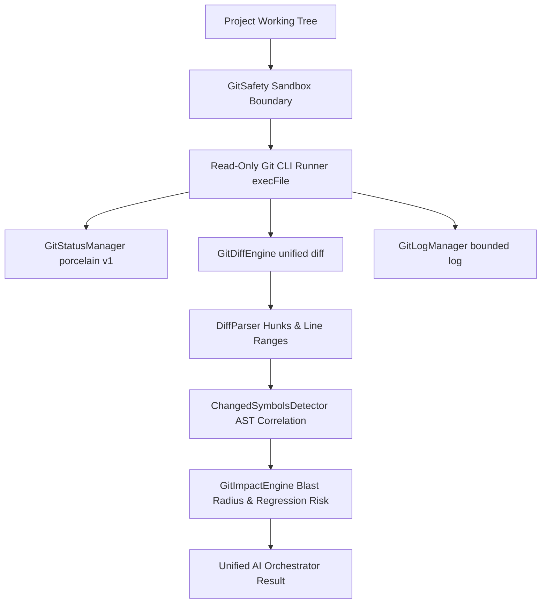

# Git Intelligence & Diff Engine Architecture — HackSync Phase 3

## Overview

HackSync Phase 3 introduces **Git Intelligence**, a safe, bounded, read-only Git analysis engine that connects repository working trees and unified diffs directly to the Phase 1 Abstract Syntax Tree (AST) symbol table and dependency graph.

---

## Architecture Diagram

---

## Core Components

### 1. Git Safety Sandbox & Boundary (`GitSafety`)

- **Strict Read-Only Execution**: Only explicitly approved subcommands (`status`, `diff`, `log`, `branch`, `rev-parse`) can be executed.
- **Forbidden Mutating Operations**: Completely blocks and throws `AuthorizationError` on:
  - `push`, `commit`, `checkout`, `reset`, `clean`, `merge`, `rebase`, `apply`, `rm`, `mv`, `init`, `clone`, `remote`, `config`, `fetch`, `pull`.
- **Project Confinement & Traversal Prevention**: Canonicalizes requested repository paths with `path.resolve` and `path.normalize`. Verifies that target repositories are strictly confined within the authorized project directory. Rejects `../` path escapes and system directory escapes.
- **No Shell Execution**: Uses `node:child_process.execFile` directly with structured argument arrays. Never invokes `/bin/sh`, `bash`, or `cmd.exe`, eliminating shell injection risks.

---

### 2. Unified Diff Parser (`DiffParser`)

Parses standard Git unified diff formats into structured representations:
- **Change Types**: `added`, `modified`, `deleted`, `renamed`, `binary`.
- **Hunk Metadata**: `oldStart`, `oldLines`, `newStart`, `newLines`, and contextual header.
- **Additions / Deletions**: Exact line metrics per file and overall diff summary.
- **Patch Snippet**: Bounded patch snippets for safe inclusion in AI prompts without blowing context windows.

---

### 3. Git Status Manager (`GitStatusManager`)

- **Porcelain v1 Parsing**: Strongly typed parser for `git status --porcelain=v1 -u`. Categorizes files into:
  - `staged` (`StatusFileEntry[]`)
  - `unstaged` (`StatusFileEntry[]`)
  - `untracked` (`string[]`)
  - `deleted` (`string[]`)
  - `renamed` (`{ from, to }[]`)
- **Workspace In-Memory Fallback**: When Git is not initialized on disk or when running in pure web sandbox mode, compares `Workspace` nodes against `memberFiles` to produce equivalent status representations.

---

### 4. Changed Symbols Detector (`ChangedSymbolsDetector`)

Bridges the gap between raw line diffs and high-level code semantics:
- Correlates unified diff hunks against `ProjectKnowledgeGraph` AST symbol entries.
- Identifies whether a modified line range intersects:
  - Function declarations and arrow functions
  - Class definitions and member methods
  - API route handlers (`app.get`, `router.post`)
  - Database operations (`db.query`, `prisma.user.findMany`)
- Flags changes as `added`, `modified`, or `deleted`.

---

### 5. Git Impact Engine & Blast Radius (`GitImpactEngine`)

Connects changed files and symbols to the project dependency graph:
1. **Downstream Dependents**: Discovers direct and transitive consumers of modified files.
2. **Affected Routes & Tables**: Flags user-facing API routes and database tables influenced by downstream modifications.
3. **Security-Sensitive Changes**: Detects changes impacting authentication, authorization, cryptography, secrets, or financial routes (e.g. `auth/`, `payments/`, `session.ts`).
4. **Regression Risk Scoring**:
   - Computes a blast radius score (0–100) based on dependents count and sensitivity.
   - Categorizes regression risk into `low`, `medium`, `high`, or `critical`.
5. **Mandatory Engineering Disclaimer**:
   > *"This impact analysis provides an estimated blast radius based on static dependency graphs and symbol calls. It represents potential downstream risk, not guaranteed runtime breakage."*
