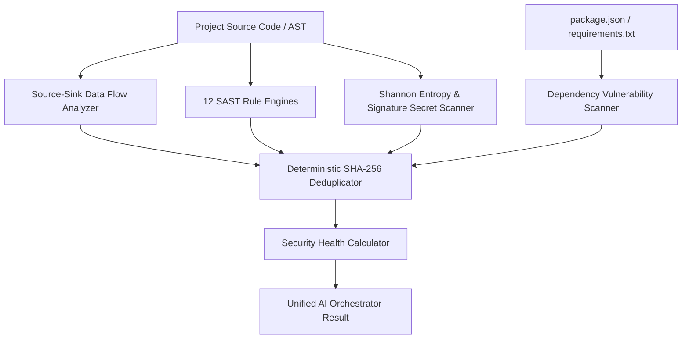

# Security Intelligence Architecture — HackSync Phase 3

## Overview

HackSync Phase 3 introduces **Security Intelligence**, a deterministic, evidence-first Static Application Security Testing (SAST), Secret Scanning, and Dependency Vulnerability analysis engine.

Security Intelligence operates strictly in **READ-ONLY** mode. It does not execute live network penetration tests against host targets (`ACTIVE_SECURITY_TESTING_UNAVAILABLE`) or mutate code. Fix generation and remediation are strictly deferred to Phase 4.

---

## Core Components

### 1. 12 Mandatory Vulnerability Categories

| Category | Identifier | Description | Default Severity |
| :--- | :--- | :--- | :--- |
| **Injection** | `SEC-INJ-001`, `SEC-INJ-002` | SQL injection via string concat / template literals; `eval()` dynamic execution | Critical |
| **XSS** | `SEC-XSS-001` | Unsanitized user HTML in `dangerouslySetInnerHTML` / `.innerHTML` | High |
| **Command Injection** | `SEC-CMD-001` | Shell invocation via `child_process.exec`, `spawn` | Critical |
| **Path Traversal** | `SEC-TRAV-001` | Dynamic filesystem access (`fs.readFile`) without path sanitization | High |
| **SSRF** | `SEC-SSRF-001` | Server-side HTTP fetch targeting unvalidated external URLs | High |
| **Authentication** | `SEC-AUTH-001` | Null user evaluation bypass; missing authentication guards | High |
| **Authorization (IDOR)** | `SEC-AUTHZ-001` | Direct object mutations by ID without tenancy or user ownership checks | High |
| **JWT / Session** | `SEC-JWT-001` | Signature verification bypass (`jwt.decode`) or `algorithm: "none"` | Critical |
| **Secrets** | `SEC-SECR-001` | Hardcoded API keys, private tokens, high-entropy secrets | Critical |
| **Cryptography** | `SEC-CRYP-001` | Broken hashes (MD5, SHA-1) for passwords, `Math.random` for tokens | High |
| **Insecure Config** | `SEC-CONF-001` | `rejectUnauthorized: false` TLS bypass, permissive CORS `*` | Critical |
| **Database Security** | `SEC-DB-001` | Plaintext passwords inserted into database without hashing | Critical |

---

### 2. Source → Sink Data Flow Analysis

The `SourceSinkAnalyzer` performs lightweight, deterministic data flow tracing across project files:
- **Untrusted Sources**: `req.query`, `req.params`, `req.body`, `headers`, `cookies`.
- **Dangerous Sinks**: `db.query`, `exec`, `spawn`, `fs.readFile`, `fetch`, `dangerouslySetInnerHTML`, `eval`.
- **Taint Propagation**: Tracks intermediate variables assigned from untrusted sources.
- **Defensive Patterns**: Acknowledges defensive sanitization (`parseInt`, `Number`, `DOMPurify.sanitize`, parameterized queries `$1, $2`) to prevent false positives.

---

### 3. Dedicated Secret Scanner & Shannon Entropy

The `SecretScanner` identifies embedded credentials using a dual-detection engine:
1. **Known Signature Regexes**: GitHub PATs, AWS Access Keys, Stripe API keys, Slack Webhooks, RSA Private Keys, Generic Bearer Tokens.
2. **Shannon Entropy Calculator**: Calculates information entropy ($H(X) = -\sum P(x) \log_2 P(x)$) over 20+ character hex and base64 strings. Strings with $H > 4.2$ are flagged.
3. **Guaranteed Secret Redaction**: The `SecretRedactor` masks all credentials in findings, evidence snippets, and tool outputs (`sk_live_...` $\to$ `sk_live_***REDACTED***`) so plaintext secrets are never written to disk, database, or LLM context.
4. **Contextual Exclusions**: Excludes tests, mock fixtures, placeholder strings (`"TODO"`, `"fake_key_0000"`), and environment variable reads (`process.env.KEY`).

---

### 4. Dependency Vulnerability Scanner

The `DependencyVulnerabilityScanner` parses ecosystem manifests (`package.json`, `requirements.txt`):
- Audits dependencies against known advisory catalogs (OSV, GHSA).
- Maintains a local advisory cache with a 1-hour TTL to prevent excessive external requests.
- Implements honest offline fallback: when manifests are unsupported or network is offline, it returns `status: "unavailable"` rather than hallucinating fake CVEs.

---

### 5. Finding Deduplication & Deterministic Fingerprints

Every finding is assigned a SHA-256 fingerprint:
$$\text{fingerprint} = \text{SHA-256}(\text{projectId} + \text{filePath} + \text{ruleId} + \text{startLine} + \text{endLine} + \text{evidenceSnippet})$$
Identical findings produced across multi-pass scans or multiple rules are collapsed into a single canonical record.

---

### 6. Security Health Score & Engineering Disclaimer

The `SecurityHealthCalculator` computes a 0–100 heuristic health score based on itemized penalties:
- **Critical SAST Finding**: -25 pts
- **High SAST Finding**: -10 pts
- **Medium SAST Finding**: -4 pts
- **Exposed Secret**: -20 pts
- **Vulnerable Dependency**: -8 pts

#### Mandatory Engineering Disclaimer
Every security health report includes the following disclaimer:
> *"This security score is a static analysis heuristic based on source code rules, pattern matching, and known dependency advisories. It does not guarantee runtime security or compliance."*
