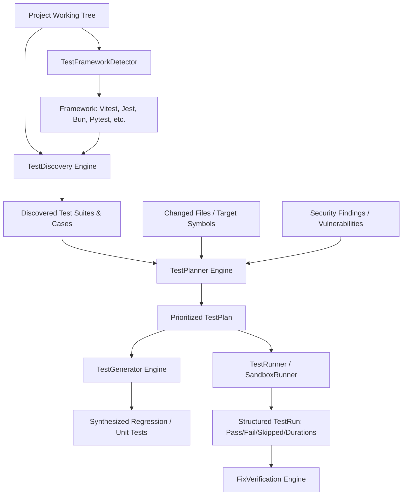

# Testing Intelligence Engine Architecture — HackSync Phase 4

## Overview

HackSync Phase 4 introduces **Testing Intelligence**, an automated discovery, framework detection, plan synthesis, and execution engine designed to connect codebases, changes, and vulnerabilities directly with targeted test validation.

---

## Architecture Diagram

---

## Core Components

### 1. Test Framework Detector (`TestFrameworkDetector`)
Detects testing frameworks, config files, and execution binaries by inspecting project manifest and configuration signatures:
- **Supported Frameworks**:
  - `vitest`: `vitest.config.ts`, `vitest.config.js`, `vite.config.ts`
  - `jest`: `jest.config.js`, `jest.config.ts`, `jest.config.json`, `package.json` jest field
  - `bun:test`: `bun.lockb`, `bun.lock`, `bunfig.toml`
  - `mocha`: `.mocharc.json`, `.mocharc.js`, `mocha.opts`
  - `pytest`: `pytest.ini`, `setup.cfg`, `pyproject.toml`
  - `unittest`: standard Python library fallback
  - `playwright`: `playwright.config.ts`, `playwright.config.js`
  - `cypress`: `cypress.config.ts`, `cypress.config.js`
- Extracts test command, watch modes, config path, coverage directory, and test pattern matching globs.

---

### 2. Test Discovery Engine (`TestDiscovery`)
Discovers test suites, test files, describe blocks, and test cases within the codebase:
- **Suite & Case Parsing**: Identifies test suites using regex AST signatures across languages:
  - TypeScript/JavaScript: `describe()`, `test()`, `it()`
  - Python: `def test_*()`, `class Test*()`
- **Source-to-Test Mapping**:
  - Matches test files to implementation files by naming conventions:
    - `auth.service.ts` <-> `auth.service.test.ts`, `auth.service.spec.ts`, `__tests__/auth.service.test.ts`
  - Leverages Phase 1 symbol index and module resolution to compute mapping confidence (`high`, `medium`, `low`).
- **Tagging & Metadata**: Categorizes tests into `unit`, `integration`, `e2e`, and `security`.

---

### 3. Test Planner (`TestPlanner`)
Generates intelligent, prioritized test execution plans based on context:
- **Targeted Test Selection**:
  - Avoids running entire monolithic test suites when only specific files or symbols are altered.
  - Automatically identifies directly mapped tests and upstream dependent tests using the Phase 1 dependency graph.
- **Security Regression Test Injection**:
  - When invoked with a security finding (e.g. SQL injection or SSRF), synthesizes high-priority test requirements designed to reproduce and verify the mitigation.
- **Prioritization**:
  - Tier 1: Direct source-to-test mapping.
  - Tier 2: Directly dependent modules.
  - Tier 3: Security verification tests.

---

### 4. Test Generator (`TestGenerator`)
Generates new unit tests and regression tests for untested code or newly discovered vulnerabilities:
- **Format**: Produces unified diff proposals without mutating the target disk.
- **Template Synthesis**:
  - TypeScript/Vitest/Jest: `describe`, `it`, `expect` assertions.
  - Python/pytest: `def test_*()`, `assert` statements.
- **Security Assertions**: Generates boundary, null-byte, injection payload, and unauthorized access test cases.

---

### 5. Safe Test Runner (`TestRunner` & `SandboxRunner`)
Executes test commands under strict security controls:
- **Allowed Binaries**: Only permit approved package managers and test runners (`bun`, `npx`, `npm`, `pnpm`, `yarn`, `vitest`, `jest`, `pytest`, `python`).
- **Forbidden Operators**: Blocks shell operators (`|`, `&`, `;`, `$`, `` ` ``, `<`, `>`, `\n`).
- **Process Isolation**: Spawns with `node:child_process.execFile` or `spawn` without shell wrapping (`shell: false`).
- **Sandbox Runner**:
  - Copies project files to an isolated temporary sandbox (`os.tmpdir()`).
  - Strips real `.env` files to prevent credentials exposure during testing.
  - Executes tests inside the sandbox and guarantees post-execution cleanup in `finally` block.
- **Secret Redaction**:
  - Output streams are filtered through redaction regexes before emitting to logs or UI.
