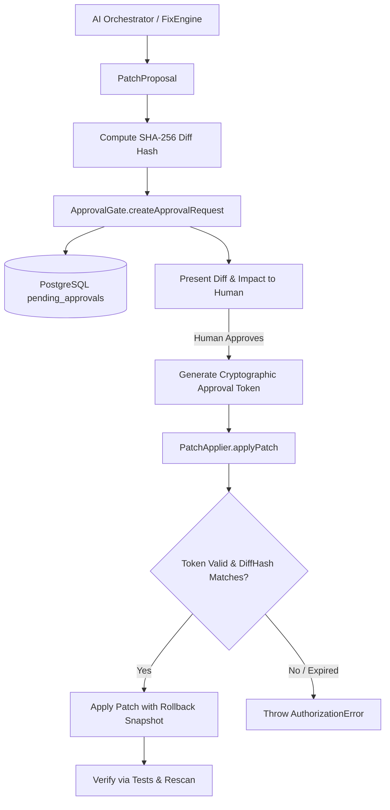

# Patch Approval & Mutation Security Architecture — HackSync Phase 4

## Overview

The core tenet of HackSync mutation security is:
> **The AI platform must NEVER silently or autonomously mutate a user repository.**
> Every code modification requires explicit, cryptographically bound human approval.

---

## The Approval Architecture

---

## Defensive Properties

### 1. Mandatory Human Approval
- `PatchApplier.applyPatch()` strictly requires a valid `approvalId` or approval token.
- Attempting to invoke `applyPatch` or use mutating tools without active approval immediately throws `AuthorizationError`.
- There is no flag, environment variable, or prompt technique that bypasses this check.

---

### 2. Cryptographic Diff Hashing & Tamper Proofing
- When an approval request is generated, a SHA-256 hash is computed across the exact unified diff string:
  $$\text{DiffHash} = \text{SHA256}(\text{normalized\_diff})$$
- When `applyPatch` is invoked, it recomputes the hash of the patch being applied and compares it against the approved `DiffHash` using constant-time comparison (`crypto.timingSafeEqual`).
- If an attacker or compromised model attempts to substitute a different patch under an approved token, execution is rejected with `INVALID_APPROVAL_HASH`.

---

### 3. Time-To-Live (TTL) & Expiry
- Approvals carry an explicit expiration timestamp (default: 15 minutes).
- Expired tokens cannot be applied and must be re-requested.

---

### 4. Single-Use Tokens
- Once an approval is consumed by `applyPatch`, its state transitions to `applied` in the audit database.
- Replaying the same approval token will result in rejection (`APPROVAL_ALREADY_USED`).

---

### 5. Multi-Tenant Project Isolation
- Approval requests are strictly scoped to `projectId` and verified against the authenticated user's project membership role via `verifyProjectMembership`.
- Users cannot approve patches for projects they do not belong to, and approvals cannot cross project boundaries.
